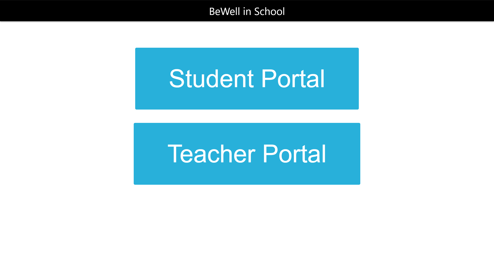
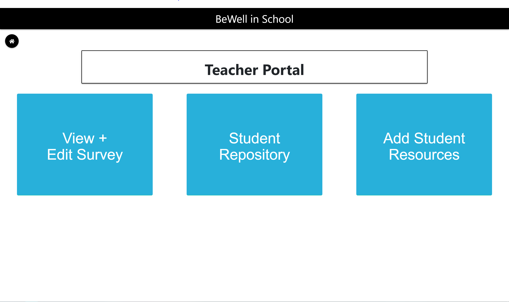
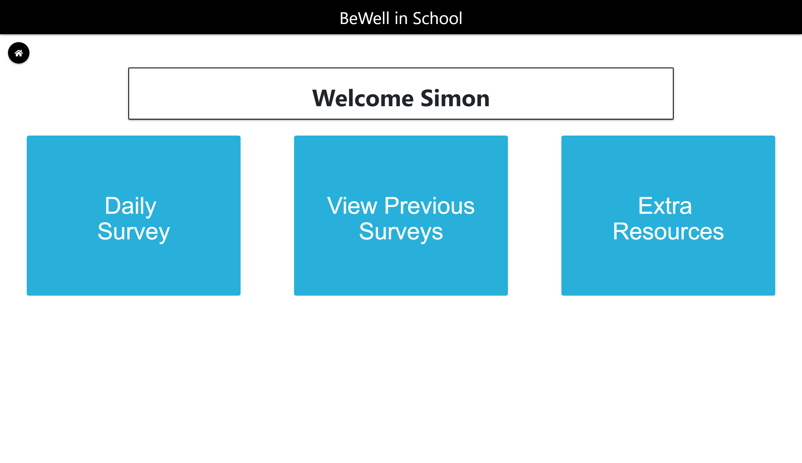

# BeWell in School

BeWell is a CRUD application that allows Yoga/Mindfulness teachers in elementary schools to create a question of the day that students are required to answer before and/or after class. Students are allowed to view previous questions and answers as well as view online resources provided by the teacher. Teachers are also able to view all individual student answers and create new questions and online resources for their students. The app's frontend is built in ReactJS and the backend is built in C#/.NET Core using SQL Server Managment Studio as a database. 





## Necesary Installs

- Git Bash
- Visual Studio 2019
- SQL Server Management Studio (SSMS)

### Git Bash
After the Windows virtual machine has successfully been installed, you'll need to download Git Bash.

To download Git Bash click <a href="https://gitforwindows.org" >here</a>.

Follow the setup process.

### Visual Studio 2019 (or higher)

To download Visual Studio 2019 click <a href="https://visualstudio.microsoft.com/downloads/">here</a>. 

Run the installer for Visual Studio that gets downloaded, and on the first window that appears, make sure the following items are checked.

1. ASP.NET Web Development Tools
2. .NET Core Cross Platform Development

Then click install at the bottom.

### SQL Server Management Studio (SSMS)

To download SSMS click <a href="https://docs.microsoft.com/en-us/sql/ssms/download-sql-server-management-studio-ssms?view=sql-server-2017">here</a>. 

Then follow the setup process.

Once SSMS has completely downloaded you'll want to run the following query, which will create the database. 

```
USE [master]
GO

/****** Object:  Database [BeWell]    Script Date: 8/19/2019 5:56:15 PM ******/
CREATE DATABASE [BeWell]
 CONTAINMENT = NONE
 ON  PRIMARY 
( NAME = N'BeWell', FILENAME = N'C:\Program Files\Microsoft SQL Server\MSSQL14.MSSQLSERVER\MSSQL\DATA\BeWell.mdf' , SIZE = 8192KB , MAXSIZE = UNLIMITED, FILEGROWTH = 65536KB )
 LOG ON 
( NAME = N'BeWell_log', FILENAME = N'C:\Program Files\Microsoft SQL Server\MSSQL14.MSSQLSERVER\MSSQL\DATA\BeWell_log.ldf' , SIZE = 8192KB , MAXSIZE = 2048GB , FILEGROWTH = 65536KB )
GO

ALTER DATABASE [BeWell] SET COMPATIBILITY_LEVEL = 140
GO

IF (1 = FULLTEXTSERVICEPROPERTY('IsFullTextInstalled'))
begin
EXEC [BeWell].[dbo].[sp_fulltext_database] @action = 'enable'
end
GO

ALTER DATABASE [BeWell] SET ANSI_NULL_DEFAULT OFF 
GO

ALTER DATABASE [BeWell] SET ANSI_NULLS OFF 
GO

ALTER DATABASE [BeWell] SET ANSI_PADDING OFF 
GO

ALTER DATABASE [BeWell] SET ANSI_WARNINGS OFF 
GO

ALTER DATABASE [BeWell] SET ARITHABORT OFF 
GO

ALTER DATABASE [BeWell] SET AUTO_CLOSE OFF 
GO

ALTER DATABASE [BeWell] SET AUTO_SHRINK OFF 
GO

ALTER DATABASE [BeWell] SET AUTO_UPDATE_STATISTICS ON 
GO

ALTER DATABASE [BeWell] SET CURSOR_CLOSE_ON_COMMIT OFF 
GO

ALTER DATABASE [BeWell] SET CURSOR_DEFAULT  GLOBAL 
GO

ALTER DATABASE [BeWell] SET CONCAT_NULL_YIELDS_NULL OFF 
GO

ALTER DATABASE [BeWell] SET NUMERIC_ROUNDABORT OFF 
GO

ALTER DATABASE [BeWell] SET QUOTED_IDENTIFIER OFF 
GO

ALTER DATABASE [BeWell] SET RECURSIVE_TRIGGERS OFF 
GO

ALTER DATABASE [BeWell] SET  DISABLE_BROKER 
GO

ALTER DATABASE [BeWell] SET AUTO_UPDATE_STATISTICS_ASYNC OFF 
GO

ALTER DATABASE [BeWell] SET DATE_CORRELATION_OPTIMIZATION OFF 
GO

ALTER DATABASE [BeWell] SET TRUSTWORTHY OFF 
GO

ALTER DATABASE [BeWell] SET ALLOW_SNAPSHOT_ISOLATION OFF 
GO

ALTER DATABASE [BeWell] SET PARAMETERIZATION SIMPLE 
GO

ALTER DATABASE [BeWell] SET READ_COMMITTED_SNAPSHOT OFF 
GO

ALTER DATABASE [BeWell] SET HONOR_BROKER_PRIORITY OFF 
GO

ALTER DATABASE [BeWell] SET RECOVERY SIMPLE 
GO

ALTER DATABASE [BeWell] SET  MULTI_USER 
GO

ALTER DATABASE [BeWell] SET PAGE_VERIFY CHECKSUM  
GO

ALTER DATABASE [BeWell] SET DB_CHAINING OFF 
GO

ALTER DATABASE [BeWell] SET FILESTREAM( NON_TRANSACTED_ACCESS = OFF ) 
GO

ALTER DATABASE [BeWell] SET TARGET_RECOVERY_TIME = 60 SECONDS 
GO

ALTER DATABASE [BeWell] SET DELAYED_DURABILITY = DISABLED 
GO

ALTER DATABASE [BeWell] SET QUERY_STORE = OFF
GO

ALTER DATABASE [BeWell] SET  READ_WRITE 
GO


```
# Running the application
In order to run the application, clone down the project from the repository and then start it by executing the code in visual studio.
